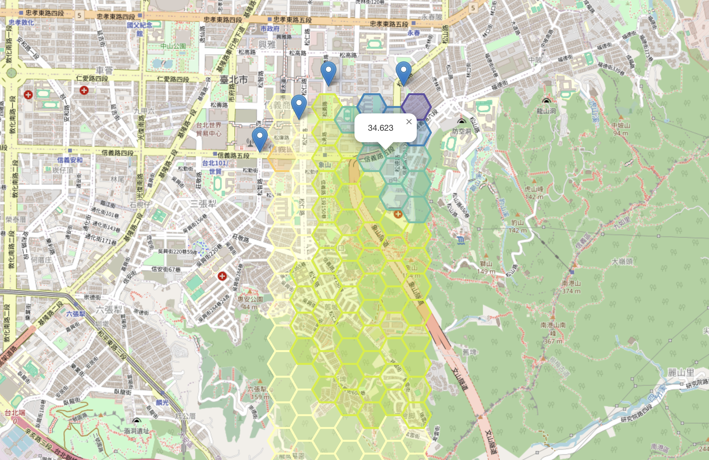
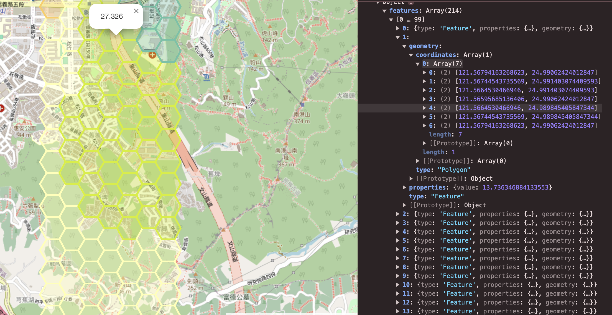

# Map POC



[Truf.js](https://turfjs.org/) 實現IDW內插法（Spatial Interpolation）

```js
 // 使用 IDW (Inverse Distance Weighting) 進行空間內插法
      const grid = turf.interpolate(points, 0.1, {
      gridType: 'hex', // Square | Points | Hex
      property: 'value',
      units: 'kilometers',
      });
```

**Grid 會是Geojson**

