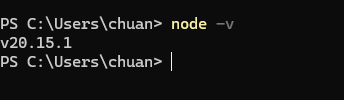

# 安裝甚麼Node.js版本？
V20.15.1 (公司需求)

# nvm vs. npm
- nvm(Node Version Manager)，Node.js 版本管理工具
- npm(Node Package Mananger)，Node.js 套件管理工具，會有像是Python裡面`Requirements.txt`的`Pacjage.json`，並有`node_module`

Ref:https://www.reddit.com/r/ProgrammerHumor/comments/pwlagf/npm_install/