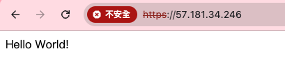

1. 你的網址，應該是 https://www.xxx.xxx，點擊過去應該要可以看到個人作業 4 架設的 Express server （由 Nginx proxy 到 Express）

[https://www.thomaschuang.me](https://www.thomaschuang.me)

2. 你在哪裡購買網域的

NameCheap

3. DNS 的 A record 是什麼？

A Record（Address Record）是 DNS 中的一種資源記錄，它將域名映射到一個 IPv4 地址。當使用者請求某個域名時，A 記錄會將該域名轉換為對應的 IP 地址，這樣客戶端才能通過網絡找到伺服器的具體位置。

以我的例子而言，`thomaschuang.me` 會有一個 A 記錄指向你的 AWS EC2 instance 的公網 IP 地址（`57.181.34.246`）。
這樣，當有人訪問 `thomaschuang.me` 時，DNS 會將這個域名解析為對應的 IP 地址，從而使請求被正確轉發到你的伺服器。

**CNAME是什麼？**

CNAME（Canonical Name Record）是 DNS 中的一種資源記錄，主要用來為一個域名建立別名。CNAME 記錄的功能是將一個域名指向另一個域名，而不是直接指向 IP 地址。這對於簡化域名管理、實現多域名指向同一主機，以及提高靈活性非常有用。

設你有一個 CNAME 記錄，將 www.thomaschuang.me 設置為指向 thomaschuang.me。
當使用者請求 www.thomaschuang.me 時，DNS 會先將該請求重定向到 thomaschuang.me，然後再解析 thomaschuang.me 的 A 記錄，找到最終的 IP 地址（`57.181.34.246`）。

4. DNS 的 NS record 是什麼？

NS Record（Name Server Record）用於指定域名的 權威 DNS 伺服器。這些伺服器負責處理和解析與該域名有關的查詢。換句話說，NS 記錄告訴網絡中其他 DNS 伺服器該找哪個伺服器來查詢域名的 A 記錄、MX 記錄等。

```
thomaschuang.me    NS    dns1.registrar-servers.com
thomaschuang.me    NS    dns2.registrar-servers.com
```

Ref:[什麼是 DNS NS 記錄？](https://www.cloudflare.com/zh-tw/learning/dns/dns-records/dns-ns-record/)

5. Domain Name vs FQDN vs URL 這三者分別為何？

5.1 Domain Name（域名）：

一個易於記憶的名稱，替代難以記憶的 IP 地址，用來標識網站或服務。例如 [example.com](https://example.com/) 就是一個域名。

5.2 FQDN（Fully Qualified Domain Name，完全合格域名）：

完全合格的域名是指一個完整的域名，包含所有層次的名稱，直到根域名。例如，[www.example.com](https://www.example.com/). 就是一個 FQDN，其中包含了主機名（www）、域名（example.com），以及一個隱式的根域名（.）。FQDN 完全唯一地標識互聯網上的一台設備或服務。

5.3 URL（Uniform Resource Locator，統一資源定位符）：

URL 是用來標識網絡上某個具體資源的位置的地址，不僅包含域名，還包括協議、路徑和其他資源定位信息。例如，[https://www.example.com/path/to/page](https://www.example.com/path/to/page) 是一個 URL，包含協議 (https)、域名 (www.example.com) 和資源的路徑（/path/to/page）。

6. 為什麼應該要為網站加上憑證？而不是直接用 http 就好

- 安全性：使用 HTTPS 加上 SSL/TLS 憑證可以對使用者與伺服器之間的通信進行加密，保護敏感信息不被攔截。HTTP 是明文傳輸，容易受到中間人攻擊，導致密碼、信用卡信息等敏感數據被竊取。
- 信任和可信度：現代瀏覽器會對未使用 HTTPS 的網站標上 "不安全" 的提示，這會降低訪問者的信任。

- SEO 優勢：搜索引擎（如 Google）會優先考慮使用 HTTPS 的網站，因此有憑證的網站在搜索排名上會有優勢。
- 數據完整性：使用 HTTPS 可以防止數據在傳輸過程中被篡改。也就是代表網站的內容和使用者提交的數據都是安全和未被修改的。

7. 寫本次作業遇到的困難

- 不太會用 ZeroSSl 卡關很久。 包含憑證不太會上傳跟nano用不習慣。
- 設定Ａ Record沒有等，東西跑不出來很緊張，但我發現`github`可以做到客製化域名，蠻有趣的。