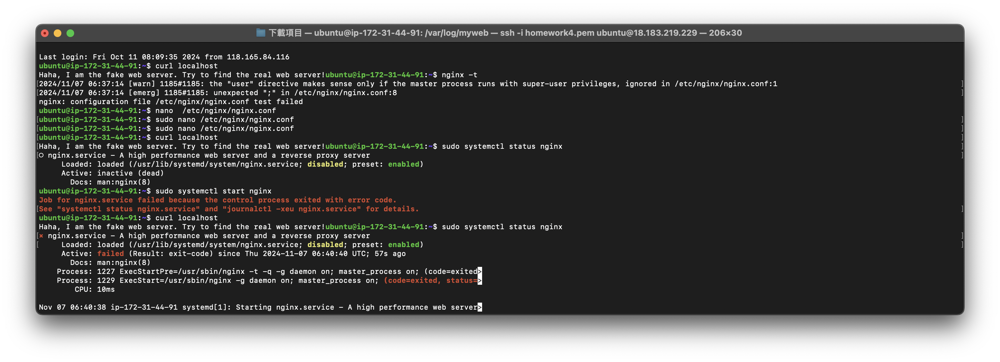
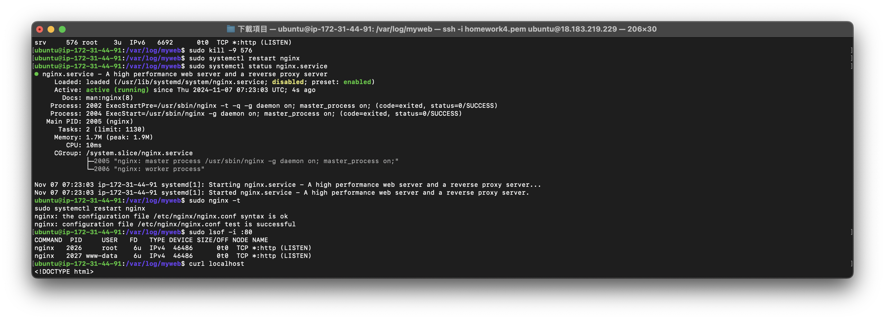
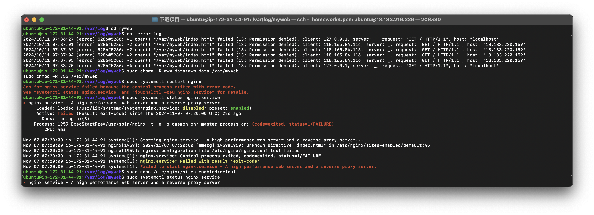
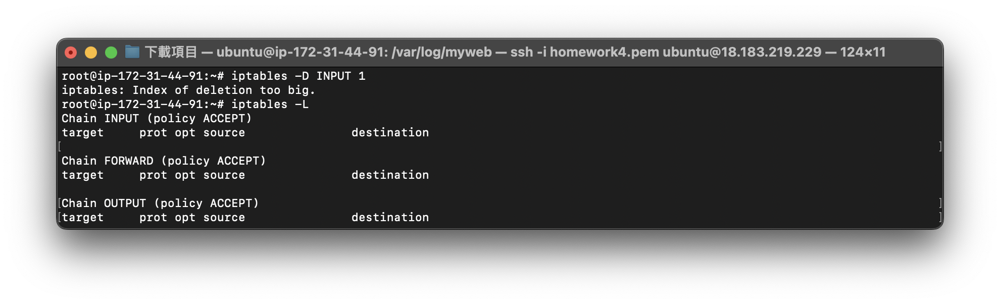
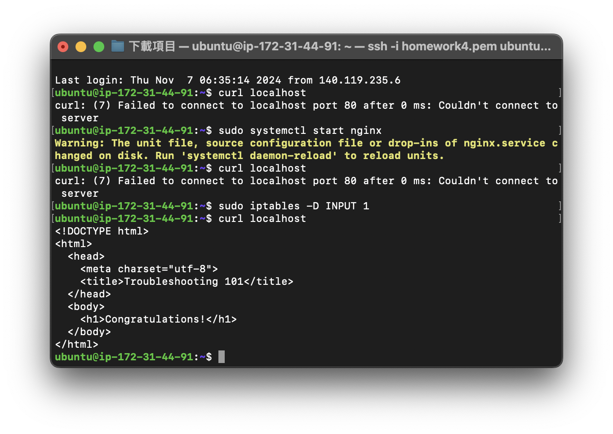

# TroubleShooting

## Step 1 先把最直白的log，分號給去掉

第一步是先使用 `nginx -t` 測試配置，但出現了語法錯誤。可以打開 `/etc/nginx/nginx.conf` 文件，檢查並修正錯誤：

然後就卡關了，Status跟start都失敗。

## Step 2 發現80被佔用

```bash
sudo lsof -i :80
```



透過kill跟重啟把`nginx`打開。

## Step 3 發現persission denied



發現可以透過`sudo chown -R www-data:www-data /var/myweb` 跟 `sudo chmod -R 755 /var/myweb` 去開通權限。

## Step 4 防火牆

打開iptables找到REJECT tcp rule
(最近在學蕭舜文老師的企業資料通訊，過了一週之後突然讀得懂了)！



感謝組員提供解決方法：

```bash
sudo iptables -D INPUT 1
```

## 成功！

再curl一次就可以了


# 一些心得

因為對後端太不了解，所以對於指令跟解決可以說是一點頭緒都沒有，好在我有很多好組員可以幫助我，想特別記下來的是，我原本想要刪除 `srv` 的 `go` 但想說這樣就好了，但其實應該是把PID kill掉就行，最大的學習是要沉住氣，慢慢想問題可能會是什麼，不過感覺要先建立起找到問題的素養還有很長一段路要走。
